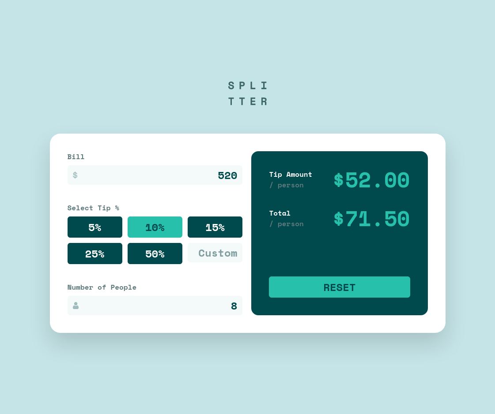

# Frontend Mentor - Tip calculator app solution

This is a solution to the [Tip calculator app challenge on Frontend Mentor](https://www.frontendmentor.io/challenges/tip-calculator-app-ugJNGbJUX). Frontend Mentor challenges help you improve your coding skills by building realistic projects.

## Table of contents

-   [Overview](#overview)
    -   [The challenge](#the-challenge)
    -   [Built with](#built-with)
    -   [Links](#links)
-   [Deployment](#deployment)
-   [Author](#author)

## Overview

### The challenge

Users should be able to:

-   View the optimal layout for the app depending on their device's screen size
-   See active states for all interactive elements on the page
-   Calculate the correct tip and total cost of the bill per person

Additionally:

-   It should be keyboard accessible
-   Responsive and ready for different environments (mobile, tablets, desktops)
-   Builds and deploys automatically via GitHub Actions on GitHub Pages

### Built with

-   [Vite.js](https://vitejs.dev/) - Build Tool
-   [TypeScript](https://typescriptlang.org/) - Strongly typed programming language that builds on JavaScript
-   [React](https://reactjs.org/) - JS library
-   [TailwindCSS](https://tailwindcss.com/) - Mobile-first utility-first CSS framework

### Links

-   [Solution (this repository)](https://github.com/wldyslw/tip-calculator)
-   [Live](https://wldyslw.github.io/tip-calculator/)

## Deployment

To develop this widget locally, you need [pnpm](https://pnpm.io/), fast, disk space efficient package manager.

Other aspects of deployment are pretty trivial:

```sh
pnpm install
pnpm dev # see your console for port. Also accessible in your local network
```

To build the widget simply:

```sh
pnpm build # see ./dist folder
```

You can also preview it to make sure that everything is fine:

```sh
pnpm preview # like with dev command, check out your console output for the port
```

## Author

[Uladzislau Maltsau](https://github.com/wldyslw/)
